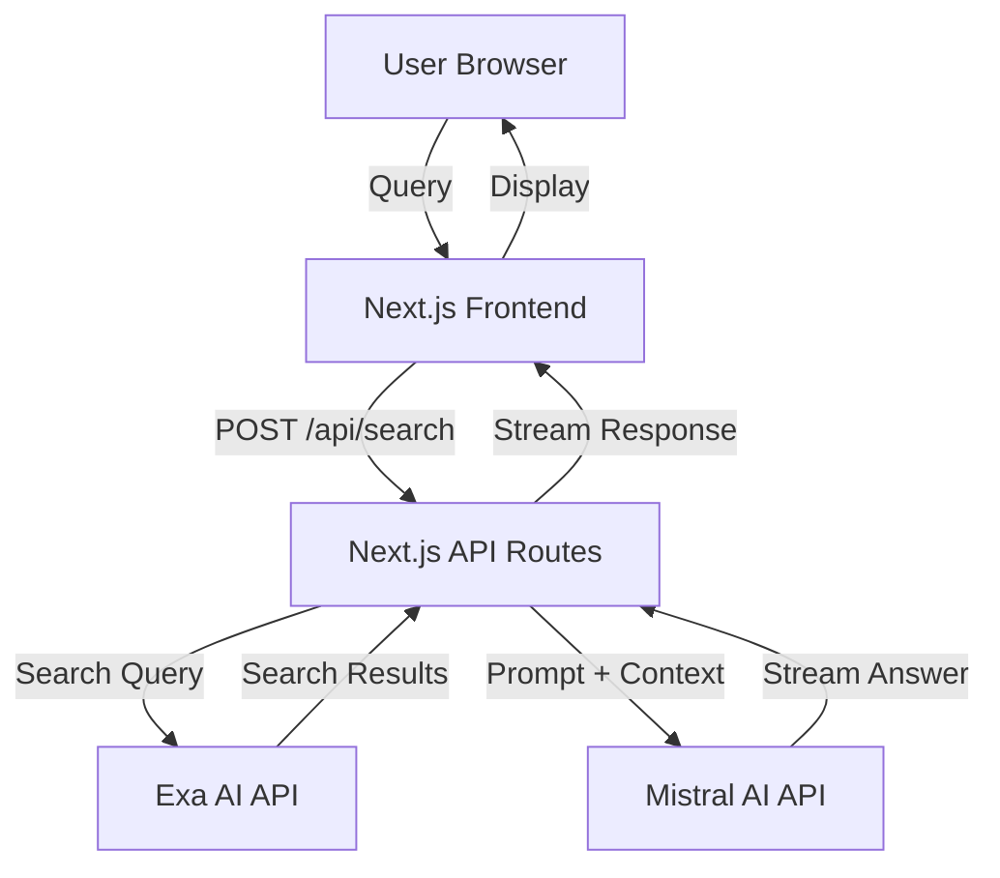

# Design Document

## Overview

The Perplexity Clone is a stateless web application that provides AI-powered search capabilities by orchestrating two external APIs: Exa AI for web search and Mistral AI for answer generation. The system follows a simple request-response pattern where each user query triggers a sequential flow: search → synthesize → display.

The architecture prioritizes simplicity and modern UX, using Next.js for both frontend and backend to minimize complexity while providing server-side API security and streaming response capabilities.

## Architecture

### High-Level Architecture



### Technology Stack

- **Frontend Framework**: Next.js 14+ with React 18+
- **Styling**: Tailwind CSS for modern, responsive design
- **Backend**: Next.js API Routes (serverless functions)
- **HTTP Client**: Native fetch API
- **Streaming**: Server-Sent Events (SSE) or streaming responses
- **Environment Management**: dotenv for local development, platform environment variables for production

### Request Flow

1. User submits query through frontend search interface
2. Frontend sends POST request to `/api/search` endpoint
3. Backend API route validates query and retrieves API credentials from environment
4. Backend calls Exa API with search query
5. Backend receives search results and formats them as context
6. Backend calls Mistral API with prompt containing search context
7. Backend streams Mistral response back to frontend
8. Frontend displays answer incrementally and shows sources

## Components and Interfaces

### Frontend Components

#### SearchInterface Component
- **Responsibility**: Main UI component containing search input and results display
- **State**:
  - `query`: string - current user input
  - `isLoading`: boolean - processing state
  - `answer`: string - generated answer text
  - `sources`: Source[] - array of source objects
  - `error`: string | null - error message if any
- **Methods**:
  - `handleSubmit()`: validates and submits query
  - `handleStreamResponse()`: processes streaming answer chunks
  - `resetState()`: clears results for new query

#### SearchInput Component
- **Responsibility**: Input field with submit button
- **Props**:
  - `value`: string
  - `onChange`: (value: string) => void
  - `onSubmit`: () => void
  - `disabled`: boolean
- **Features**: Auto-focus, enter key handling, empty query prevention

#### AnswerDisplay Component
- **Responsibility**: Renders generated answer with progressive loading
- **Props**:
  - `answer`: string
  - `isStreaming`: boolean
- **Features**: Markdown rendering, smooth text appearance

#### SourcesList Component
- **Responsibility**: Displays source citations
- **Props**:
  - `sources`: Source[]
- **Features**: Clickable links, title/URL display, external link indicators

#### LoadingIndicator Component
- **Responsibility**: Visual feedback during processing
- **Props**:
  - `isVisible`: boolean
- **Features**: Animated spinner or skeleton UI

#### ErrorMessage Component
- **Responsibility**: User-friendly error display
- **Props**:
  - `message`: string
  - `onRetry`: () => void
- **Features**: Clear messaging, retry button

### Backend API Routes

#### POST /api/search
- **Request Body**:
  ```typescript
  {
    query: string
  }
  ```
- **Response**: Streaming text with JSON chunks
  ```typescript
  // Streamed chunks:
  { type: 'answer', content: string }
  { type: 'sources', content: Source[] }
  { type: 'error', content: string }
  { type: 'done' }
  ```
- **Error Responses**:
  - 400: Invalid query
  - 500: API failure
  - 503: Service unavailable

### External API Integrations

#### Exa API Client
- **Module**: `lib/exa-client.ts`
- **Official SDK**: `exa-js` npm package
- **Base URL**: `https://api.exa.ai`
- **Authentication**: Bearer token via `x-api-key` header
- **Primary Method**: `searchAndContents()`
- **Configuration**:
  ```typescript
  {
    apiKey: process.env.EXA_API_KEY,
    query: string,
    numResults: 5-10,  // Configurable number of results
    contents: {
      text: true,      // Get text content
      highlights: true // Get relevant highlights
    }
  }
  ```
- **Response Fields**:
  - `results[]`: Array of search results
    - `title`: string - Page title
    - `url`: string - Page URL
    - `text`: string - Full text content
    - `highlights`: string[] - Relevant excerpts
    - `publishedDate`: string - Publication date (if available)
    - `score`: number - Relevance score
- **Error Handling**: Network errors, rate limiting (429), invalid API key (401), timeout

#### Mistral API Client
- **Module**: `lib/mistral-client.ts`
- **Official SDK**: `@mistralai/mistralai` npm package
- **Base URL**: `https://api.mistral.ai`
- **Authentication**: Bearer token via `Authorization` header
- **Primary Method**: `chat.stream()` for streaming responses
- **Configuration**:
  ```typescript
  {
    apiKey: process.env.MISTRAL_API_KEY,
    model: 'mistral-large-latest', // or 'mistral-medium-latest'
    messages: [
      { role: 'system', content: string },
      { role: 'user', content: string }
    ],
    temperature: 0.7,
    maxTokens: 1000,
    stream: true
  }
  ```
- **Streaming Response**: Server-Sent Events (SSE) with delta chunks
  - Each chunk contains: `{ choices: [{ delta: { content: string } }] }`
- **Error Handling**: Network errors, rate limiting (429), invalid API key (401), token limits (400)

## Data Models

### Source
```typescript
interface Source {
  id: string;           // Unique identifier
  title: string;        // Page title
  url: string;          // Source URL
  snippet?: string;     // Optional text excerpt
}
```

### ExaSearchResult
```typescript
// Based on Exa API response structure
interface ExaSearchResult {
  title: string;
  url: string;
  text: string;              // Full text content
  highlights?: string[];     // Relevant excerpts from Exa
  score: number;             // Relevance score (0-1)
  publishedDate?: string;    // ISO date string
  author?: string;           // Author if available
}
```

### MistralMessage
```typescript
// Based on Mistral API message format
interface MistralMessage {
  role: 'system' | 'user' | 'assistant';
  content: string;
}
```

### MistralStreamChunk
```typescript
// Based on Mistral API streaming response
interface MistralStreamChunk {
  choices: [{
    delta: {
      content?: string;
    };
    finishReason?: 'stop' | 'length' | 'error';
  }];
}
```

### SearchRequest
```typescript
interface SearchRequest {
  query: string;
}
```

### SearchResponse
```typescript
interface SearchResponse {
  answer: string;
  sources: Source[];
}
```

### ErrorResponse
```typescript
interface ErrorResponse {
  error: string;
  message: string;
  retryable: boolean;
}
```

## Prompt Engineering

### Mistral Prompt Structure

The system will construct prompts for Mistral API following this pattern:

**System Message**:
```
You are a helpful AI assistant that answers questions based on provided search results. 
Provide accurate, well-structured answers and cite sources using [1], [2], etc. 
Keep answers concise but comprehensive.
```

**User Message Template**:
```
Question: {user_query}

Search Results:
[1] {source_1_title}
URL: {source_1_url}
Content: {source_1_text}

[2] {source_2_title}
URL: {source_2_url}
Content: {source_2_text}

...

Based on these search results, please answer the question. Use citations like [1], [2] to reference sources.
```

### Context Formatting Strategy

- Limit each source content to ~500 tokens to stay within token limits
- Include 5-10 most relevant sources from Exa results
- Prioritize sources with higher relevance scores
- Use Exa highlights when available for more focused context
- Total context should stay under 8000 tokens to allow room for response

## Correctness Properties

*A property is a characteristic or behavior that should hold true across all valid executions of a system—essentially, a formal statement about what the system should do. Properties serve as the bridge between human-readable specifications and machine-verifiable correctness guarantees.*


### Property Reflection

After reviewing all testable acceptance criteria, several properties can be consolidated:
- Properties 6.2, 6.3, and 6.5 all test statelessness and can be combined
- Properties 2.3, 3.4, and 8.1 all test error handling and can be unified
- Properties 7.1 and 7.2 both test environment variable configuration

The following properties represent unique, non-redundant validation requirements:

Property 1: Input acceptance for arbitrary length queries
*For any* non-empty string of any length, the search input field should accept and store the text value
**Validates: Requirements 1.2**

Property 2: Empty query rejection
*For any* string composed entirely of whitespace characters, submitting the query should be prevented and the application state should remain unchanged
**Validates: Requirements 1.4**

Property 3: Exa API invocation
*For any* valid query submitted, the system should make an API call to Exa with that query as a parameter
**Validates: Requirements 2.1**

Property 4: Search result extraction
*For any* valid Exa API response, the system should successfully extract title, URL, and text content from each result
**Validates: Requirements 2.2**

Property 5: Context formatting for Mistral
*For any* set of search results retrieved from Exa, the system should format them into a structured prompt containing source numbers, titles, URLs, and content
**Validates: Requirements 3.1**

Property 6: Mistral API invocation
*For any* formatted context, the system should make an API call to Mistral with the context included in the prompt
**Validates: Requirements 3.2**

Property 7: Answer extraction from Mistral response
*For any* valid Mistral API streaming response, the system should successfully extract and concatenate the content from all delta chunks
**Validates: Requirements 3.3**

Property 8: Source display completeness
*For any* set of sources used in answer generation, all sources should be displayed in the UI with both title and URL visible
**Validates: Requirements 4.1, 4.2, 4.5**

Property 9: Loading state transitions
*For any* query submission, the loading indicator should transition from false to true immediately, remain true during processing, and return to false when results are ready
**Validates: Requirements 5.1, 5.2, 5.3**

Property 10: Input disabled during processing
*For any* query being processed, the search input field should have the disabled attribute set to true
**Validates: Requirements 5.5**

Property 11: Stateless query processing
*For any* sequence of two queries, the second query should be processed without any reference to or influence from the first query's data
**Validates: Requirements 6.2, 6.3, 6.5**

Property 12: Result replacement
*For any* new search results received, the previous results should be completely cleared from the UI state before displaying new results
**Validates: Requirements 6.4**

Property 13: API credential security
*For any* client-side code bundle or network response, API credentials should not appear in the content
**Validates: Requirements 7.3**

Property 14: API authentication
*For any* API call to Exa or Mistral, the request should include proper authentication headers with credentials from environment variables
**Validates: Requirements 7.4**

Property 15: Error message display
*For any* API failure (Exa or Mistral), the system should display a user-friendly error message without technical details or stack traces
**Validates: Requirements 8.1, 8.4**

Property 16: Error recovery
*For any* error state, the UI should provide a mechanism to retry the query
**Validates: Requirements 8.5**

Property 17: Streaming response handling
*For any* stream of answer chunks received from Mistral, the UI should update incrementally with each chunk
**Validates: Requirements 9.2**

Property 18: Graceful stream interruption
*For any* interrupted streaming response, the system should display the partial answer received up to the interruption point without crashing
**Validates: Requirements 9.5**

## Error Handling

### Error Categories

1. **Validation Errors** (400)
   - Empty or whitespace-only queries
   - Malformed requests
   - User-facing message: "Please enter a valid question"

2. **Authentication Errors** (401)
   - Invalid or missing API keys
   - User-facing message: "Service configuration error. Please contact support"

3. **Rate Limiting** (429)
   - Too many requests to Exa or Mistral
   - User-facing message: "Too many requests. Please wait a moment and try again"

4. **API Failures** (500, 503)
   - Exa or Mistral service unavailable
   - Timeout errors
   - User-facing message: "Service temporarily unavailable. Please try again"

5. **Network Errors**
   - Connection failures
   - DNS resolution errors
   - User-facing message: "Network error. Please check your connection"

### Error Handling Strategy

- All errors caught at API route level
- Errors transformed into user-friendly messages before sending to frontend
- Frontend displays errors with retry button
- Errors logged server-side for debugging (without exposing to users)
- Streaming errors handled by closing stream gracefully and showing partial results

### Retry Logic

- User-initiated retry only (no automatic retries)
- Retry button clears error state and allows new submission
- Rate limit errors suggest waiting before retry

## Testing Strategy

### Unit Testing

**Framework**: Vitest with React Testing Library

**Unit Test Coverage**:
- Component rendering and user interactions
- Input validation logic
- Error message formatting
- State management in components
- API client error handling
- Prompt formatting functions

**Example Unit Tests**:
- SearchInput component prevents empty submissions
- SourcesList renders all provided sources
- Error messages display correctly
- Loading states toggle appropriately

### Property-Based Testing

**Framework**: fast-check (JavaScript/TypeScript property-based testing library)

**Configuration**: Minimum 100 iterations per property test

**Property Test Coverage**:
Each correctness property listed above will be implemented as a property-based test. Tests will generate random inputs (queries, API responses, error conditions) and verify the specified properties hold across all generated cases.

**Test Tagging Convention**:
Each property-based test must include a comment with this exact format:
```typescript
// **Feature: perplexity-clone, Property {number}: {property description}**
```

**Example Property Tests**:
- Property 2: Generate random whitespace strings, verify all are rejected
- Property 4: Generate random Exa API responses, verify extraction succeeds
- Property 11: Generate pairs of queries, verify no state leakage
- Property 15: Generate various API errors, verify no stack traces in messages

### Integration Testing

**Scope**: End-to-end flow with mocked external APIs

**Test Scenarios**:
- Complete search flow: query → Exa → Mistral → display
- Error scenarios: API failures at each stage
- Streaming response handling
- Multiple sequential queries

**Mocking Strategy**:
- Mock Exa API responses with realistic data structures
- Mock Mistral streaming responses with chunked data
- Simulate various error conditions

### Testing Execution Order

1. Implement core functionality
2. Write property-based tests for that functionality
3. Run tests and fix any failures
4. Write unit tests for edge cases
5. Integration tests for complete flows
6. All tests must pass before considering feature complete

## Deployment Considerations

### Environment Variables

Required environment variables:
```
EXA_API_KEY=your_exa_api_key
MISTRAL_API_KEY=your_mistral_api_key
```

### Platform Recommendations

- **Vercel**: Optimal for Next.js deployment, built-in environment variable management
- **Netlify**: Alternative with similar Next.js support
- **Docker**: For self-hosted deployments

### Performance Considerations

- API routes are serverless functions (cold start latency possible)
- Streaming responses reduce perceived latency
- No database means no query overhead
- Static assets cached at CDN edge

### Security Considerations

- API keys never exposed to client
- CORS configured for production domain only
- Rate limiting at API route level (optional)
- Input sanitization for XSS prevention
- HTTPS required in production
